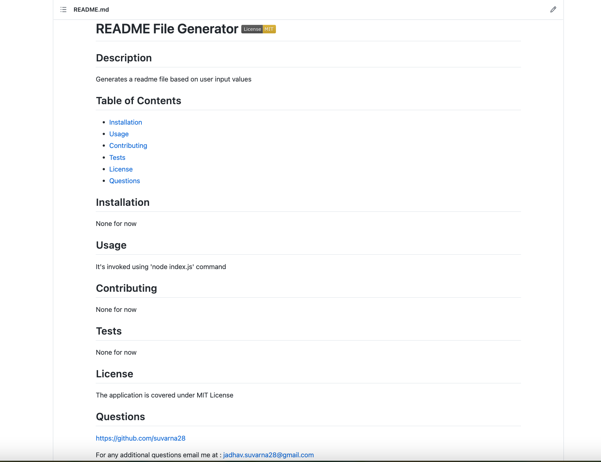

# readmefile-generator

## Description 

This is a nodejs command-line application that dynamically generates a README file based on user's input. The application uses nodejs Inquirer package to achieve the same. 

The application can be invoked by using 'node index.js' command. 

* Once invoked it will ask you for the project title. This will be added to the readme file as the title. 
* Then it will ask you for description, installation instructions, usage, contribution guidelines, and test instructions as a series of questions one after the other. All the entered information will be added to the readme file under respective sections.
* Then it will ask you to choose a license from a list of licenses. The choosen license will be added at the top of the readme besides the title and a short note will be added under section 'License'.
* Then it will ask you for your GitHub username, this will be added under section 'Questions' with a link to your GitHub profile. 
* Then it will ask you for your email address, this will be added under section 'Questions' with the entered email and instructions on how to reach you.  
* A 'Table of Contents' is also created at the top of the readme file, when you click on the respective section, it will take you to that section of the file.
* After answering all the questions you will see a 'Success!' message and a README file will be created under folder 'Output'.

## Features

* The features are same as explained in the description, please refer above.

## Installation

N/A

## Screenshot

## Link to the GitHub repo of the application

https://github.com/suvarna28/readmefile-generator

## Link to the walkthrough video demonstrating the functionality of the application

https://drive.google.com/file/d/1o6CIYlietJsJESKAmDwC572fNQ-kwwXf/view

## Credits

* Out TA, Sebastian for answering homework related doubts. 
* @lukas-h github, for learning how to add license to the file.
* Shields.io for learning how to add license to the file.
* Claire Lee and MaSandra Ewing, for letting me know that we have to use the starter code in generateMarkdown.js file. 

